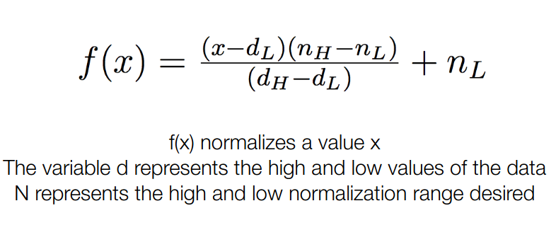

# Tarea 1:

## Lluvia en Australia Manana

## Dataset

El dataset se encuentra en https://www.kaggle.com/jsphyg/weather-dataset-rattle-package, el cual tiene una extension de. Este dataset contiene las observaciones sobre el clima diario en numerosas estaciones de clima en Australia. Ademas contiene una variable que dice si llovió el día siguiente al guardado por la estacion. 

### Preprocesamiento
Primero que nada usamos la librería pandas para poder cargar el csv y realizar un preprocesamiento sobre este. El dataset contenía varias columnas con valores inexistentes o *NA*, por ello eliminamos las columnas que no que contenian una cantidad considerable de ellos (varios miles) y eliminamos algunas filas menores que contenían *NA*. Ademas, eliminamos las columnas de *Date* y *Location*. Entonces las columnas eliminadas fueron *Date, Location, Evaporation, Sunshine, Cloud3pm, Cloud9am, RISK\_MM*. Las columnas *RainToday* y *RainTomorrow*, tenían variables de la forma *No* y *Yes*, por lo que se remplazaron por 0 y 1 respectivamente. Las variables categóricas que contenían las direcciones del viento, las transformamos a con valores de 0 y 1, colocando cada valor categórico como columna y un valor de 1 si pertenecía a la fila en la que se encontraba, 0 en el caso contrario.

Luego procedimos a normalizar los datos con la función:

 

 

, donde $x$ es el valor de la celda; $nh$ el valor superior de la normalización, en nuestro caso 1; $nl$ el valor inferior de la normalización, en nuestro caso 0; $dh$ el valor máximo de la columna en donde se encuentra $x$; y $dl$ el valor minimo de la columna donde se encuentra $x$.

Finalmente dividimos el dataset en 2, dejando un 80\% para el entrenamiento del modelo (red neuronal), y un 20\% con propositos de testeo.

## Metodo de Machine Learning

## Metodo de evaluacion

## Analisis y Resultados

## Conclusion

 