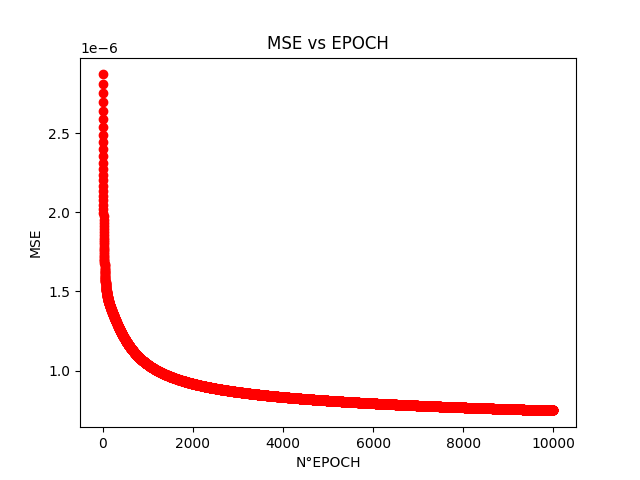
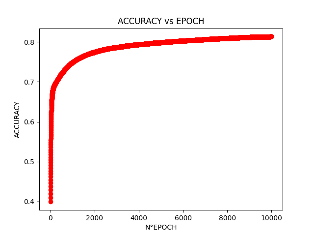
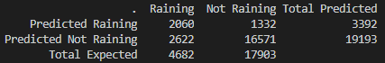

# Tarea 1:

## Lluvia en Australia Mañana
El link de github que contiene este Readme con sus imagenes se encuentra en:
https://github.com/CArielSanchez/CC5114-Redes-Neuronales/tree/master/Tarea1
## Dataset

El dataset se encuentra en https://www.kaggle.com/jsphyg/weather-dataset-rattle-package, el cual tiene una extension de. Este dataset contiene las observaciones sobre el clima diario en numerosas estaciones de clima en Australia. Ademas contiene una variable que dice si llovió el día siguiente al guardado por la estacion. 

### Preprocesamiento
Primero que nada usamos la librería pandas para poder cargar el csv y realizar un preprocesamiento sobre este. El dataset contenía varias columnas con valores inexistentes o *NA*, por ello eliminamos las columnas que no que contenian una cantidad considerable de ellos (varios miles) y eliminamos algunas filas menores que contenían *NA*. Ademas, eliminamos las columnas de *Date* y *Location*. Entonces las columnas eliminadas fueron *Date, Location, Evaporation, Sunshine, Cloud3pm, Cloud9am, RISK\_MM*. Las columnas *RainToday* y *RainTomorrow*, tenían variables de la forma *No* y *Yes*, por lo que se remplazaron por 0 y 1 respectivamente. Las variables categóricas que contenían las direcciones del viento, las transformamos a con valores de 0 y 1, colocando cada valor categórico como columna y un valor de 1 si pertenecía a la fila en la que se encontraba, 0 en el caso contrario.

Luego procedimos a normalizar los datos con la función:

 

, donde **x** es el valor de la celda; **nh** el valor superior de la normalización, en nuestro caso 1; **nl** el valor inferior de la normalización, en nuestro caso 0; **dh** el valor máximo de la columna en donde se encuentra **x**; y **dl** el valor minimo de la columna donde se encuentra **x**.

Finalmente dividimos el dataset en 2, dejando un 80% para el entrenamiento del modelo (red neuronal), y un 20% con propositos de testeo.

## Metodo de Machine Learning

Para realizar machine learning como forma de resolucion del problema planteado previamente, se crea una red neuronal a partir de funciones sigmoides que permiten un alto aprendizaje de la red a nivel global. Se utilizo como base el archivo subido por el Profesor a U-cursos, llamado NeuralNetwork.py.

La red anteriormente descrita presenta:
- Input Layer:  58 sigmoides como input.
- Hidden Layer: 58 sigmoides en su capa oculta. 
- Output Layer: 1 sigmoide como output.

## Metodo de evaluacion
 
 Para la evaluacion del modelo se utilizo la medida de *Accuracy*, pera calcular el costo se utilizo el *MSE*, o error cuadratico medio, por ultimo se calculo la matriz de confusion del testeo de los datos.

## Analisis y Resultados
### Desarrollo de la Red Neuronal

 
### Matriz de Confusion

    A partir de esta se desprende lo siguiente:
    - RECALL:    
                *Raining:    0.440
                *NotRaining: 0.926
    - PRECISION:    
                *Raining:    0.607
                *NotRaining: 0.863
## Conclusion

El error se redujo bastante cada vez que avanza cada epoca, sin embargo se queda estancado alrededor de la epoca 8.000, donde peresenta poca variacion en comparacion de la epoca 10.000. Tambien a medida que iba disminuyendo el MSE (error o costo), se puede apreciar que el *Accuracy* aumentaba de manera inversa.
Se puede apreciar desde la matriz de confusion que el modelo se predice de buena manera si no va a llove, con un *RECALL* de 0.926 y un *PRECISION* de 0.863. Sin embargo, cuando intenta predecir que llueve el *RECALL* alcanza solo un 0.44, con *PRECISION* alcanzando un 0.607. Esto puede deberse a que la cantidad de datos de lluvia es mucho menor a la cantidad de datos de no lluvia.

## Librerias

Las librerias utilizadas son: 
- Numpy. Libreria para manejo de matrices y operaciones entre estas. Ademas, de poder inicializar matrices aleatoriamente.

-  Pandas. Libreria para carga y pre-procesamiento de dataset.

- Matplotlib. Libreria grafica para mostrar comparaciones entre datos.

La forma de instalar librerias estan en el archivo [InstallLibraries](InstallLibraries.md)
