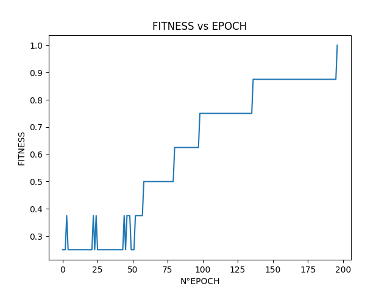
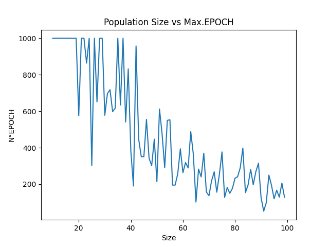
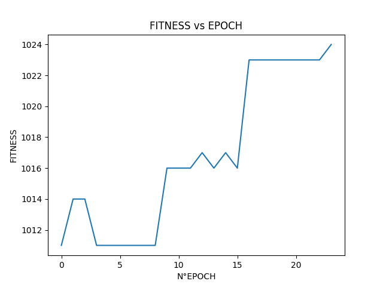
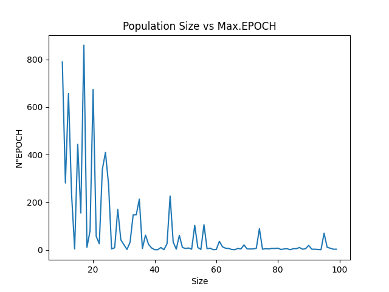
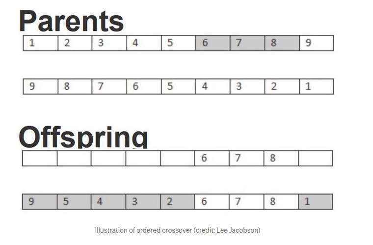
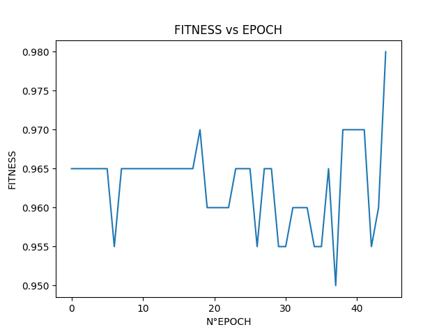
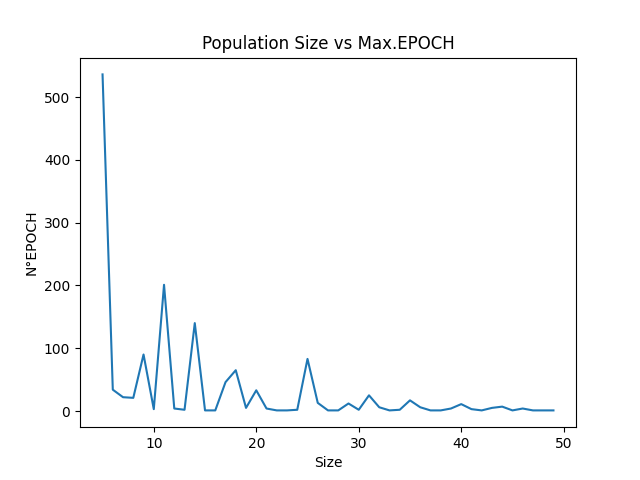

# Tarea 2:

## Algoritmo Genetico

El link de github que contiene este Readme con sus imagenes se encuentra en:
https://github.com/CArielSanchez/CC5114-Redes-Neuronales/tree/master/Tarea2

Integrantes:
- Valentín Espina
- Cristian Sánchez

# Palabra

## Descripción del Problema

El problema consiste en encontrar una palabra oculta usando un algoritmo genético, al cual solo se le informa que tan cerca de la respuesta está.

## Algoritmo Genetico Usado

### Funcionamiento

El algoritmo recibe:
- Tamaño de la poblacion: Donde la población es un cojunto de individuos.
- Tasa de la mutación: Es la probabilidad de mutar un gen de un individuo.
- Fintess: Es la función que indica que tan cerca esta de la respuesta.
- GeneFactory: Es la función que genera un gen aleatoriamente.
- IndividualFactory: Es la función que genera un individuo aleatoriamente.
- MaxIter: Es la máxima epoca que puede alcanzar el algoritmo.
- Selector: Es tipo de selector que se usara para elegir a un individuo.
- TerminationCondition: Es la condición de termino del algoritmo.

Primero el algoritmo inicializa la población, utilizando IndividualFactory para crear los individuos de acuerdo al tamaño de la población.
Luego, el algoritmo itera hasta que se alcanza MaxIter o TerminationCondition, generando nuevos individuos a través de la herencia y la mutacion, de una generacion a otra. 
Finalmente cuando terminan las iteraciones, el algoritmo entrega el mejor individuo de esa generación en base a su fitness.

### Selector

Para seleccionar a un individuo dentro de una lista de individuos utilizaremos el algoritmo de la ruleta, donde se escoge a un individuo aleatoriamente, donde su probabilidad de ser escogido es directamente proporcional a su fitness, entonces a mayor fitness mayor probabilidad de ser escogido.

### Herencia

Para calcular la herencia entre 2 individuos se elije aleatoriamente una posición para cortar los genes de los 2 individuos, en donde para crear un nuevo individuo, se escoge el primer trozo del primer individuo y el segundo trozo del segundo individuo.

### Mutacion

Para realizar la mutacion de un individuo, se genera un gen aleatoriamente y se intercambia con uno seleccionado (usando la función de seleccion) teniendo en cuenta la tasa de mutacion (mutation rate), para decidir si intercambiarlo o no.

## Instancia del Algoritmo 

Para instanciar el algoritmo genético para ser utilizado para encontrar la palabra secreta definimos una Clase llamada SecretWord.
Esta clase recibe una palabra, el número de genes utilizado (que será la cantidad de carácteres de la palabra) y el tamaño de la población.
Además la clase contiene los metodos para crear un gen, para crear un individuo, para correr el algoritmo genético y para calcular el fitness.

### Función de Fitness

La función fitness definida por nosotros, calcula la cantidad de carácteres iguales a la palabra secreta, y lo normalizamos, esto es dividiendolo por el número de genes.

## Experimentos

Para probar nuestro algoritmo genético, realizamos 2 tipos de estudios o experimetos. El primer experimento, estudia el comportamiento del fitness a través de las epocas y el segundo experimento nos puestra la variacion de la época alcanzanda, dependiendo del tamaño de la población utilizado.

### Fitness vs Epoch

 

### Epoch vs Popsize

 

# Binario

## Descripción del Problema

El problema consiste en encontrar la transformacion binaria de un número, utilizando un algoritmo genético, al cual solo se le informa qué tan cerca esta del número preguntado.

## Algoritmo Genetico Usado

El algoritmo genetico usado, es el mismo que el utilizado en el problema de la palabra secreta, al igual que los métodos de mutacion, herencia y el uso del selector tipo ruleta.

## Instancia del Algoritmo 

Para instanciar el algoritmo genético a ser utilizado, creamos una Clase llamada Binary, el cual para instanciar este objeto recibe el número a convertir, la cantidad de genes utilizados y el tamaño de la población a utilizar. Además tenemos métodos para generar un gen, el cuál generara un número aleatorio de 1 o 0; un método para crear un individuo aleatoriamente; un metodo para el cálculo de fitness y un metodo para correr el algoritmo genético, instanciando el selector con una tasa de mutación de 0.1 y con una condicion de termino para cuando se alcance el *Número Máximo*.
El número máximo sera definido como 2 elevado al número de genes.
Cabe destacar que para calcular el número de genes transformamos el número a convertir a binario y se utilizó el largo de este.

### Función de Fitness

La función fitness definida por nosotros, transforma el individuo, que es un número binario en string, en un número entero. Luego se calcula la diferencia entre el numero a convertir y el individuo y se resta al número máximo.

## Experimentos

Para probar nuestro algoritmo genético, realizamos 2 tipos de estudios o experimetos. El primer experimento, estudia el comportamiento del fitness a través de las epocas y el segundo experimento nos puestra la variacion de la época alcanzanda, dependiendo del tamaño de la población utilizado.

### Fitness vs Epoch

 

### Epoch vs Popsize

 

# Traveling Salesman Problem (TSP)

## Descripción del Problema

El problema consiste en encontrar la combinacion de ciudades que recorridas en aquel orden, la distancia recorrida sea mínima (óptima).

## Algoritmo Genetico Usado

El algoritmo recibe:
- Tamaño de la poblacion: Donde la población es un cojunto de individuos.
- Tasa de la mutación: Es la probabilidad de mutar un gen de un individuo.
- Fintess: Es la función que indica que tan cerca esta de la respuesta.
- GeneFactory: Es la función que genera un gen aleatoriamente.
- IndividualFactory: Es la función que genera un individuo aleatoriamente.
- MaxIter: Es la máxima epoca que puede alcanzar el algoritmo.
- Selector: Es tipo de selector que se usara para elegir a un individuo.
- TerminationCondition: Es la condición de termino del algoritmo.

Primero el algoritmo inicializa la población, utilizando IndividualFactory para crear los individuos de acuerdo al tamaño de la población.
Luego, el algoritmo itera hasta que se alcanza MaxIter o TerminationCondition, generando nuevos individuos a través de la herencia y la mutacion, de una generacion a otra. 
Finalmente cuando terminan las iteraciones, el algoritmo entrega el mejor individuo de esa generación en base a su fitness.

### Selector

El selecector utilizado es el de la ruleta, el mismo utilizado para los 2 problemas anteriores.

### Herencia

Para calcular la herencia entre 2 individuos, hay que tener en cuenta que las ciudades no pueden repetirse dentro de un individuo, por lo que hay que modificar el algoritmo de herencia mencionado en los 2 problemas anteriores. Entonces para realizar la herencia, seleccionamos la cantidad de genes que deseamos mantener en el primer individuo y luego la posición en la que se encuentran los genes a mantener, por defecto los genes seleccionados se encuentran el uno al lado del otro. Luego de que tenemos este set de genes del individuo 1 selecionado, utilizando el individuo 2 rellenamos los genes vacios en orden sin repetir aquellos que ya se encuentran en el individuo 1. Para un mayor entendimiento véase la imagen.

 

### Mutacion

Para cacular la mutacíon de un individuo hay que modificar el algoritmo utilizado en los 2 problemas anteriores, ya que las ciudades no pueden repetirse. Entonces, el algoritmo de mutacion escoge 2 genes aleatoriamente y los intercambia entre sí, teniendo en cuenta la tasa de mutación, para decidir si realizar la mutación.

## Instancia del Algoritmo 

Para poder resolver el problema se crearon 2 clases, la clase City, que crea una ciudad para ser utilizada, y la clase TravelingSalesman, que se centra en instanciar el algoritmo genético para resolver el problema.

### Clase City

La clase City es utilizada para crear una ciudad, esta  clase recibe el nombre, la latitud, la longitud y la máxima posicion de una coordenada que puede tener una ciudad generada aleatoriamente, es decir sin especificar latitud ni longitud. Esta clase tiene metodos para poder calcular la distancia entre 2 ciudades; la distancia entre una ciudad y la coordenada (0,0); un metodo para crear aleatoriamente ambas coordenadas de una ciudad; y dos metodos para obtener las coordenadas y el nombred de la ciudad.

### Clase TravelingSalesman

Para instanciar el algoritmo genético a ser utilizado, creamos una Clase llamada TravelingSalesman, el cual para instanciar este objeto recibe una lista de ciudades, la cantidad de genes utilizados(es decir la cantidad de ciudades) y el tamaño de la población a utilizar. Además tenemos métodos para generar un gen, el cuál generara una ciudad aleatorie dentro de la lista de ciudades; un método para crear un individuo aleatoriamente, es decir una combinacion de ciudades; un metodo para el cálculo de fitness y un metodo para correr el algoritmo genético, instanciando el selector con una tasa de mutación de 0.1 y con una condicion de termino para cuando se un fitness mayor a 0.98.
El Número Máximo sera definido como la máxima distancia entre una ciudad y la coordenada (0,0), multiplicado por el número de genes amplificado 10.

### Función de Fitness

Para el cálculo de la función fitness, sumamos las distancias entre todas las ciudades, las restamos al Número Máximo y lo dividimos por el Número Máximo, para tener una especie de normalizacíon.

## Experimentos

Para probar nuestro algoritmo genético, realizamos 2 tipos de estudios o experimetos. El primer experimento, estudia el comportamiento del fitness a través de las epocas y el segundo experimento nos puestra la variacion de la época alcanzanda, dependiendo del tamaño de la población utilizado.

### Fitness vs Epoch

 

### Epoch vs Popsize

 

# Conclusión

Como se puede observar en los gráficos de *Fitness vs Epoch* de los 3 experimentos el fitness calculado tiende a aumentar a lo largo de las epocas, sin embargo existen variaciones locales que no presentan este comportamiento. Esto puede deberse a que la mutación y herencia alteran a todos los individuos de la poblacion, ya sea mejorando o empeorando su fitness. Este impacto podría ser minimizado, heredando en cada una de las iteraciones al individuo con máximo fitness en aquella iteración.

Como se aprecia en los graficos de *Epoch vs Popsize* mientras mayor sea la poblacion, el número de iteraciones realizadas disminuirá, convergiendo a un tamaño de población óptimo. Aquí también se pueden notar variaciones locales mencionades anteriormente.

# Librerias

Las librerias utilizadas son: 
- Numpy. Libreria para manejo de matrices y operaciones entre estas. Ademas, de poder inicializar matrices aleatoriamente.

- Random, Libreria para generar números aleatoriamente.

- Sys, Libreria que maneja constantes del sistema.

- Math, Libreria para formulas matemáticas.

- Matplotlib. Libreria grafica para mostrar comparaciones entre datos.

La forma de instalar librerias estan en el archivo [InstallLibraries](InstallLibraries.md)
