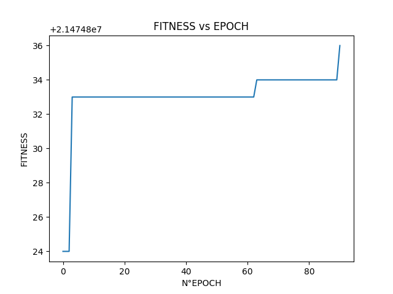
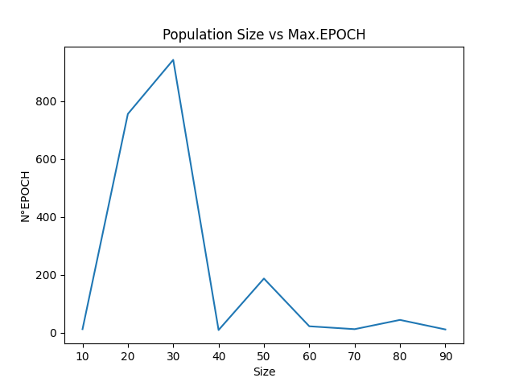
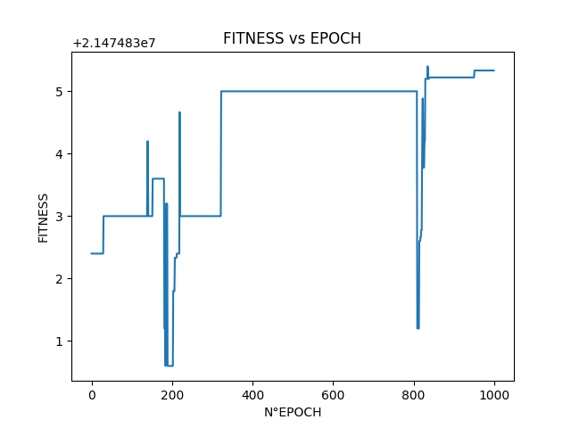
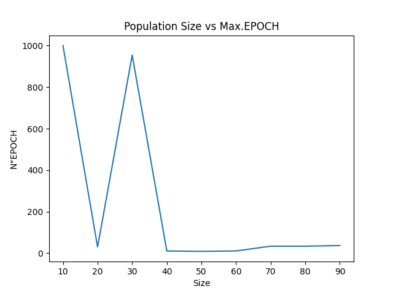
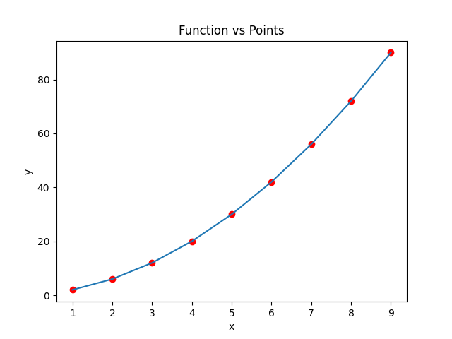
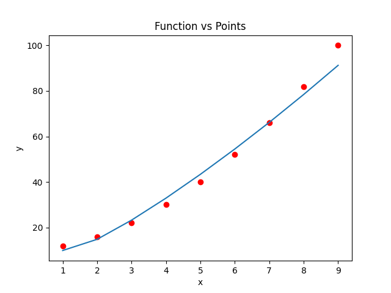

# Tarea 3:

## Algoritmo Genetico en Arboles

El link de github que contiene este Readme con sus imagenes se encuentra en:
https://github.com/CArielSanchez/CC5114-Redes-Neuronales/tree/master/Tarea3

Integrantes:
- Valentín Espina
- Cristian Sánchez
# Arbol
Un arbol esta conformado por un conjunto de Nodos, los cuales estan vinculados con otros Nodos o con Hojas.
## Nodos
Un Nodo es un Objeto que contiene un Valor, una referencia a un Nodo Izquierdo, y una Referencia a un Nodo Derecho.
### Metodos
- setValor: Cambia el valor de un nodo
- soyHoja:  Revisa si soy Hoja o no.
- setNodoIzquierdo: Cambia la referencia izquierda a un Nodo.
- setNodoDerecho: Cambia la referencia derecha a un Nodo.
- getNodoIzq: Obtiene el nodo de refencia izquierda.
- getNodoDer: Obtiene el nodo de refencia derecha.
- getValor: Obtiene el valor de un Nodo.
- numberHojas: Obtiene el numeron de Hojas que posee un Nodo.
      
## Hojas
Una Hoja es un Nodo que contiene un Valor,pero no una referencia a un Nodo Izquierdo, ni a un Nodo Derecho.

## Metodos de Arbol
- copyNodo: Copia un Determinado Nodo.
- copy: Copia un Determinado Arbol
- addRandomNodo: Agrega un Nodo de manera aleatoria, remplazandolo por la Hoja de un arbol.
- setRandomNodo: Cambia de manera aleatoria, un nodo por otro.
- setRandomHoja: Cambia de manera aleatoria, una hoja por otra.
- setRandomOperation: Cambia de manera aleatoria, una operacion por otra.
- getRaiz: Obtiene la raiz de un arbol
- replaceNodo: Remplaza un determinado nodo, por otro nodo especifico.
- findNodo_nHojas: Encuentra el numero de hojas de un nodo especifico.
- evaluate: Evalua un determinado arbol, donde sus hojas solo poseen valores numericos, y sus Nodos valores operacionales (*,/,+;-).
- evaluatePoint:  Evalua un determinado arbol, donde sus hojas solo poseen valores numericos o la incognita 'x', y sus Nodos valores operacionales (*,/,+;-). Para evaluarlo se reemplazara el valor 'x' por uno determinado.
- imprimir: Genera un String con las operaciones realizadas dentro del arbol, generando parentesis donde corresponda.

# Deschifres

## Descripción del Problema

El problema consiste en encontrar un valor, utilizando las operaciones [ *, +, /, - ], y un determinado set de números.

## Algoritmo Genetico Usado

### Funcionamiento

El algoritmo recibe:
- Tamaño de la poblacion: Donde la población es un conjunto de individuos.
- Tasa de la mutación: Es la probabilidad de mutar un gen de un individuo.
- Fintess: Es la función que indica que tan cerca esta de la respuesta.
- GeneFactory: Es la función que genera un gen aleatoriamente.
- IndividualFactory: Es la función que genera un individuo aleatoriamente.
- MaxIter: Es la máxima epoca que puede alcanzar el algoritmo.
- Selector: Es tipo de selector que se usará para elegir a un individuo.
- TerminationCondition: Es la condición de término del algoritmo.
- set_numbers: Es el set de numeros utilizados para encontrar la operacion que resuelve el problema.
- set_operations: Es el set de operaciones utilizadas para resolver el problema.

Primero el algoritmo inicializa la población, utilizando IndividualFactory para crear los individuos de acuerdo al tamaño de la población.
Luego, el algoritmo itera hasta que se alcanza MaxIter o TerminationCondition, generando nuevos individuos a través de la herencia y la mutacion, de una generacion a otra. 
Finalmente cuando terminan las iteraciones, el algoritmo entrega el mejor individuo de esa generación en base a su fitness.

### Selector

Para seleccionar a un individuo dentro de una lista de individuos utilizaremos el algoritmo de la ruleta, en el cual se escoge a un individuo aleatoriamente, donde su probabilidad de ser escogido es directamente proporcional a su fitness, entonces a mayor fitness mayor probabilidad de ser escogido.

### Herencia

Para calcular la herencia entre 2 individuos se elije aleatoriamente una posición para cortar los genes de los 2 individuos de manera que tengan el mismo numero de Hojas, en donde para crear un nuevo individuo, se escoge un Nodo del primer individuo y un Nodo del segundo individuo, donde el segundo remplaza al primero en el arbol.

### Mutacion

Para realizar la mutacion de un individuo este se mutara si y solo si su mutation rate es mayor a un numero generado de forma aleatoria.
Si se da el caso entonces de forma aleatoria el arbol se mutara de 3 formas posibles, se cambiara el valor de un Nodo Hoja, se modificara el valor de la operacion de un Nodo o se intercambiara un nodo por otro(ambos de igual tamaño).

## Instancia del Algoritmo 

Para instanciar el algoritmo genético para ser utilizado para encontrar el valor esperado definimos una Clase llamada Deschiffres.
Esta clase recibe el valor a obtener, el set de numeros a utilizar y el tamaño de la población.
Además la clase contiene los métodos para crear un gen, para crear un individuo, para correr el algoritmo genético y para calcular el fitness.

### Función de Fitness

La función fitness definida por nosotros, calcula la diferencia entre el valor resultante y el esperado. Con el fin de obtener numeros positivos se le restara esta diferencia a un numero maximo definido por nosotros. Ademas si se llega a producir una division por 0, el fitness de retorno sera 0.

## Experimentos

Para probar nuestro algoritmo genético, realizamos 2 tipos de estudios o experimetos. El primer experimento, estudia el comportamiento del fitness a través de las epocas y el segundo experimento nos puestra la variacion de la época alcanzanda, dependiendo del tamaño de la población utilizado. 

### Fitness vs Epoch

 

### Epoch vs Popsize

 

## Analisis
- Del grafico Fitness vs Epoch se puede observar claramente la mejoria existente en el fitness mientras aumenta el numero de epocas del algoritmo, donde claramente su poblacion se acerca mas al resultado esperado.
- Del grafico de  Epoch vs Popsize se puede observar saltos en el numero de iteraciones cuando la poblacion es muy baja, sin emabrgo con una poblacion mayor estos saltos no se producen, manteniendose numero de iteraciones muy bajo. Estos casos aislados se pueden llegar a producir debido a algun fallo de la implementacion del algoritmo en donde en alguna mutacion o herencia, los cambios en los individuos con bajo fitness no son tan relevantes.
# FitLinear

## Descripción del Problema

El problema consiste en encontrar la funcion que se adecua a un determinado set de puntos.

### Funcionamiento

El algoritmo recibe:
- Tamaño de la poblacion: Donde la población es un conjunto de individuos.
- Tasa de la mutación: Es la probabilidad de mutar un gen de un individuo.
- Fintess: Es la función que indica que tan cerca esta de la respuesta.
- GeneFactory: Es la función que genera un gen aleatoriamente.
- IndividualFactory: Es la función que genera un individuo aleatoriamente.
- MaxIter: Es la máxima epoca que puede alcanzar el algoritmo.
- Selector: Es tipo de selector que se usará para elegir a un individuo.
- TerminationCondition: Es la condición de término del algoritmo.
- set_points: Es el set de puntos utilizados para encontrar la funcion que resuelve el problema.
- set_operations: Es el set de operaciones utilizadas para resolver el problema.
- MaxNum: Es el valor maximo que se puede utilizar en las Hojas de los individuos.

Primero el algoritmo inicializa la población, utilizando IndividualFactory para crear los individuos de acuerdo al tamaño de la población.
Luego, el algoritmo itera hasta que se alcanza MaxIter o TerminationCondition, generando nuevos individuos a través de la herencia y la mutacion, de una generacion a otra. 
Finalmente cuando terminan las iteraciones, el algoritmo entrega el mejor individuo de esa generación en base a su fitness.

### Selector

Para seleccionar a un individuo dentro de una lista de individuos utilizaremos el algoritmo de la ruleta, en el cual se escoge a un individuo aleatoriamente, donde su probabilidad de ser escogido es directamente proporcional a su fitness, entonces a mayor fitness mayor probabilidad de ser escogido.

### Herencia

Para calcular la herencia entre 2 individuos se elije aleatoriamente una posición para cortar los genes de los 2 individuos, en donde para crear un nuevo individuo, se escoge un Nodo del primer individuo y un Nodo del segundo individuo, donde el segundo nodo remplazara al primero dentro de su arbol.

### Mutacion

Para realizar la mutacion de un individuo este se mutara si y solo si su mutation rate es mayor a un numero generado de forma aleatoria.
Si se da el caso entonces de forma aleatoria el arbol se mutara de 3 formas posibles, se cambiara el valor de un Nodo Hoja, se modificara el valor de la operacion de un Nodo o se intercambiara un nodo por otro(ambos de igual tamaño).

## Instancia del Algoritmo 

Para instanciar el algoritmo genético para ser utilizado para encontrar la funcion que resuelve el problema definimos una Clase llamada FitLinear.
Esta clase recibe un set de puntos a utilizar y el tamaño de la población.
Además la clase contiene los métodos para crear un gen(Nodo), para crear un individuo(Arbol), para correr el algoritmo genético y para calcular el fitness.

### Función de Fitness

La función fitness definida por nosotros, calcula la diferencia entre el valor resultante y el esperado. Con el fin de obtener numeros positivos se le restara esta diferencia a un numero maximo definido por nosotros. Ademas si se llega a producir una division por 0, el fitness de retorno sera 0.

## Experimentos

Para probar nuestro algoritmo genético, realizamos 2 tipos de estudios o experimetos. El primer experimento, estudia el comportamiento del fitness a través de las épocas y el segundo experimento nos muestra la variacion de la época alcanzanda, dependiendo del tamaño de la población utilizado.Y finalmente se compararan los puntos entregados, con la funcion obtenida.

### Fitness vs Epoch

 

### Epoch vs Popsize

 

### Function vs Points
- Function: x+x*x
 
- Function: 10+x+x*x
 

## Analisis
- Del grafico Fitness vs Epoch, se puede apreciar nuevamente casoss
# Librerias

Las librerias utilizadas son: 
- Numpy. Libreria para manejo de matrices y operaciones entre estas. Ademas, de poder inicializar matrices aleatoriamente.

- Random, Libreria para generar números aleatoriamente.

- Sys, Libreria que maneja constantes del sistema.

- Math, Libreria para formulas matemáticas.

- Matplotlib. Libreria grafica para mostrar comparaciones entre datos.

La forma de instalar librerias estan en el archivo [InstallLibraries](InstallLibraries.md)
